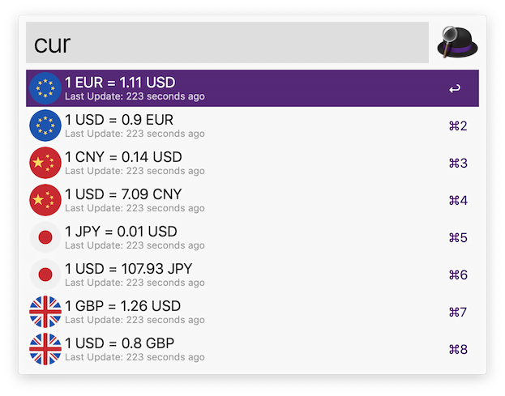
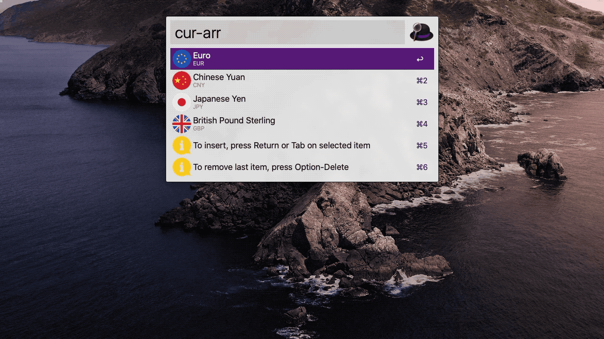

    

# Coon

Coon is an Alfred workflow which do currency conversion by using live currency rates from Open Exchange Rates API. For a complete list of support currencies, see [Currencies](./Currencies.md).

<!-- MarkdownTOC autolink="true" -->

- [Setup](#setup)
  - [Prerequisite](#prerequisite)
  - [Installation](#installation)
  - [Config & Settings](#config--settings)
- [User Guide](#user-guide)
  - [Classic Methods](#classic-methods)
  - [Setting & Help Methods](#setting--help-methods)
  - [Support Currencies](#support-currencies)
- [Credit & License](#credit--license)

<!-- /MarkdownTOC -->

## Setup

### Prerequisite

* Any macOS which has built-in Python 2.7
  * That normally referred to macOS 10.6+, but things will likely change following the release of Catalina (10.15)
* Alfred 3+ with [Powerpack](https://www.alfredapp.com/powerpack/)

### Installation

* Head overto [Releases](https://github.com/tomy0000000/Coon/releases), download the latest version
* Double-click on `Coon.alfredworkflow` to install
* Auto-Update of workflow is enabled by default, but can be switch by sending query
  * `cur workflow:autoupdate` for enabling Auto-Update
  * `cur workflow:noautoupdate` for disabling Auto-Update

### Config & Settings

* Config can be set in [workflow environment variables sheet](https://www.alfredapp.com/help/workflows/advanced/variables/#environment), by pressing `[x]` icon in Alfred Preferences
* Settings is a json file located at `~/Library/Application Support/Alfred/Workflow Data/tech.tomy.coon`, or type the magic arguments `cur workflow:opendata` in Alfred will take you diractly to that diractory
* Please setup your `APP_ID` before your first run, otherwise this workflow won't even work, at all.

| Type     | Name        | Function                                                     | Default                        |
| -------- | ----------- | ------------------------------------------------------------ | ------------------------------ |
| Config   | `APP_ID`    | Credentials to aquire currencies rates, can be obtain at [Open Exchange Rates](https://openexchangerates.org/) for free |                                |
| Config   | `PRECISION` | Round off position after decimal point                       | `2`                            |
| Config   | `EXPIRE`    | Threshold to trigger rates update in seconds                 | `300`                          |
| Config   | `BASE`      | Your primary, daily-use currency                             | `USD`                          |
| Settings | `favorites` | Favorite conversion list                                     | `["EUR", "CNY", "JPY", "GBP"]` |

## User Guide

### Classic Methods

The following examples demonstrate the usage with the default config and settings

* `cur`: Convert between all favorite currencies and base currency with 1 unit

* `cur [value]`: Convert between all favorite currencies and base currency with [value] unit

* `cur [currency]`: Convert between [currency] and base currency with 1 unit

* `cur [value] [currency]`: Convert between [currency] and base currency with [value] unit

* `cur [currency_1] [currency_2]`: Convert between [currency_1] and [currency_2] with 1 unit

* `cur [value] [currency_1] [currency_2]`: Convert between [currency_1] and [currency_2] with [value] unit

* Position-insensitive: besides the `cur` keyword, every parameter in the above methods are position-insensitive. Namely, the following query all outputs the same results:
  * `cur 5 GBP CAD`
  * `cur 5 CAD GBP`
  * `cur GBP 5 CAD`
  * `cur CAD 5 GBP`
  * `cur GBP CAD 5`
  * `cur CAD GBP 5`

### Setting & Help Methods

* `cur-add`: Add a new currency to favorite list
* `cur-rm`: Remove a currency from favorite list
* `cur-arr`: Arrange orders of the favorite list

* `cur-ref`: Refresh Currency List & Rates
* `cur-help`: Show a list of example usage or opens up this README

### Support Currencies

See [Currencies](./Currencies.md)

## Credit & License

* This project is inspired by [FlyRabbit/alfred3-workflow-CurrencyX](https://github.com/FlyRabbit/alfred3-workflow-CurrencyX)

  I made this spin-off because the original one doesn't work in the way I thought it should be. As I'm trying to tweaking the the old ones, things get more out of control which ended up me deciding to re-write my own version.

* Core Library depends on the work-of-art-library: [deanishe/alfred-workflow](https://github.com/deanishe/alfred-workflow)
* API provided by [Open Exchange Rates](https://openexchangerates.org/)
* Icon licenses as below

| Name              | Author                      | Source                                                       |
| ----------------- | --------------------------- | ------------------------------------------------------------ |
| Main icon         | Freepik                     | [Flaticon](https://www.flaticon.com/free-icon/exchange_1924021) |
| Hint icons        | Maxim Basinski              | [Flaticon](https://www.flaticon.com/packs/universal-icons)   |
| Fiat Currencies   | Freepik                     | [Flaticon](https://www.flaticon.com/packs/countrys-flags)    |
| Cryptocurrencies  | Freepik                     | [Flaticon](https://www.flaticon.com/packs/ecommerce-and-payment-method-logos) |
| EarthCoin (EAC)   | earthcoinreloaded/earthcoin | [GitHub](https://github.com/earthcoinreloaded/earthcoin)     |
| Factom (FCT)      | Factom, Inc.                | [Factom](https://www.factom.com/trademarks/)                 |
| Feathercoin (FTC) | FeatherCoin/Feathercoin     | [GitHub](https://github.com/FeatherCoin/Feathercoin)         |
| VertCoin (VTC)    | vertcoin-project/VertDocs   | [GitHub](https://github.com/vertcoin-project/VertDocs)       |

* Any source code unmentioned above are released under the [MIT license](https://github.com/tomy0000000/Coon/blob/master/LICENSE)