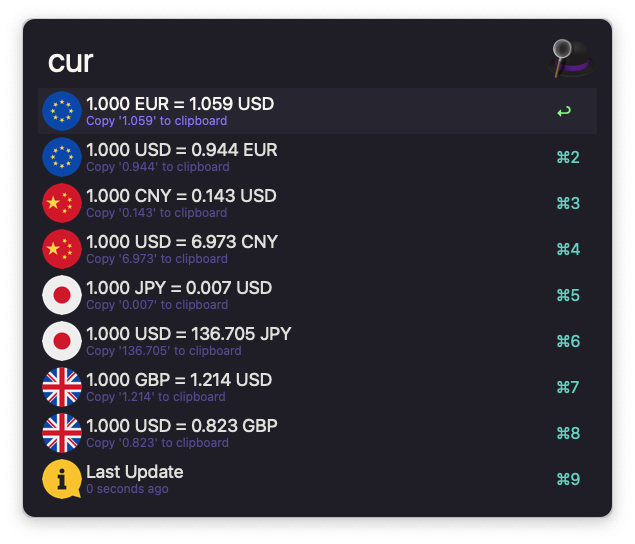

    

# Coinc

Coinc is an Alfred workflow that does currency conversion by using live currency rates from Open Exchange Rates API.

Dwonload and install from [Alfred Gallery](https://alfred.app/workflows/tomy0000000/coinc).

For a list of support currencies, Installation, Setup, and Usage, see [Wiki](../../wiki)
